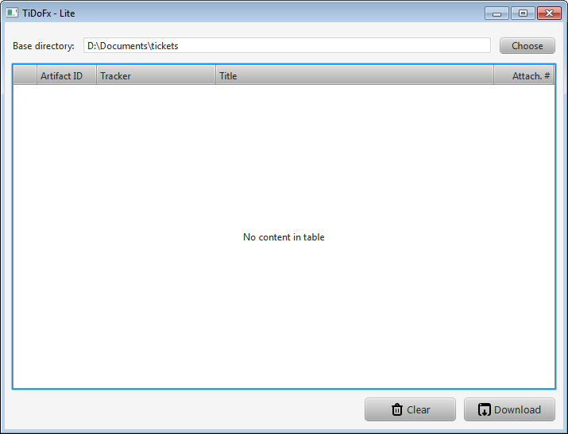

TiDoFx Ticket Downloader
========================

TiDoFx is a small JavaFX application that can automatically download all the
attachments of a TeamForge ticket into a user-definable directory.

TiDoFx require a recent Java 1.7 JRE to run (at least 1.7.0_u25).

Installation and Configuration
------------------------------

1. Unzip the _TiDoFx-0.0.x.zip_ archive somewhere on your hard disk.
1. Configure the application following the instructions below.
1. Start the application double clicking on _"Ticket Downloader.exe"_
1. Drag&drop ticket links from the TeamForge page onto the central list.
1. Select the base directory for the tickets by clicking on the _Choose_ button.
1. Click on the _Fetch_ button.

All the attachments of the tickets in the list will be downloaded and saved
in a number of ticket-specific directories located below the base directory.

The current naming convention for the ticket directories is:

> *"[artifact Id]_[title]"* in lower case

All punctuation and illegal characters are removed from the final name.

### Server configuration ###

Credentials for the TeamForge servers known to the user must be manually
entered in a configuration file named `servers.xml`.

Here is an example of this file:

    <?xml version="1.0" encoding="UTF-8"?>
    <servers>
        <server>
            <!-- Simple string identifying the server -->
            <id>TF</id>

            <!-- Longer name for the server -->
            <name>Internal TF server</name>

            <!-- Root URL of the server -->
            <url>https://tf.example.com</url>

            <!-- Username -->
            <username>username</username>

            <!-- Password -->
            <password>password</password>
        </server>

        <!-- Add other server elements here -->
    </servers>

Once created, the servers file should be copied to the local application
configuration directory. The location of this directory depends on the
Operating System:

* `%APPDATA%\TiDoFx` on Windows (e.g. `C:\Users\JohnDoe\AppData\Roaming\TiDoFx`).
* `~/.tidofx` on Linux.

This directory must be manually created by the user before saving the servers file.

Future versions of the application will streamline this entire process.

### Ticket directory name customisation ###

The logic for generating the directory names is implemented as a JavaScript
function embedded in the application.

To customise the directory name, create a JavaScript file named `dir-namer.js`
in the configuration directory, alongside the other configuration files.

What follows is the script used to generate the default directory names.

    /*
     * This function must return a string that represents the path
     * where the ticket artifacts will be saved.
     *
     * Global variables:
     *      "S": the main String.js object with many utility methods to operate on strings.
     *      "separator": the platform directory separator character.
     *
     * Arguments:
     *      "ticket": the tido.model.Ticket java object containing the ticket data.
     *
     * For more information on String.js see: http://stringjs.com
     */
    function generateName( ticket ) {

        // convert from Java to JavaScript strings
        // this needed to operate on string using String.js functions
        var title = "" + ticket.title;

        // calculate name
        var cleaned = S( title ).trim().stripPunctuation().collapseWhitespace().replaceAll(' ', '_').s;
        cleaned = cleaned.toLowerCase();

        var ret = ticket.id + "_" + cleaned;

        return ret;
    }

The script must define a function named `generateName` that takes one argument:

* __ticket__  
  The tido.model.Ticket java object containing the ticket data.

and return a string with the generated ticket directory name.

The `Ticket` object contains the following fields:

* __url__  
  The complete artifact URL (e.g. `https://sf43.elektrobit.com/sf/go/artf74149`).

* __id__  
  The artifact id (e.g. `artf74149`).

* __title__  
  The artifact title (e.g. `[Screen] The buttons are not visible`).

* __kpm__  
  The KPM number (e.g. `50478039`).

* __tracker__  
  The Tracker that contains the ticket (e.g. `Internal Interface Tickets`).

* __description__  
  The ticket description.

* __analysis__  
  The ticket analysis.

They all can be used to generate a directory name.

Build
-----

Tools needed:

* a recent Java 1.7 JDK
* Gradle (not strictly necessary)

The project uses [Gradle] as build system but, to simplify development,
the Gradle Wrapper is supported. If you don't want to install Gradle, just use
the provided `gradlew` command like you would use the regular `gradle` command.

### Packaging ###

A distributable archive can be created wit the following command:

    gradlew clean distribZip

When the command terminates, a zip file containing the application and a
private JRE packaged together. The archive is quite big but can be deployed
on any machine regardless of local JRE availability.

### Eclipse support ###

I am sorry but I don't use Eclipse to develop TiDoFx. Patches and comments
are welcome.

[Gradle]: http://www.gradle.org/

Dependencies
------------

This program uses:

* __Jsoup__: Java HTML Parser ([jsoup.org](http://jsoup.org/)).
* __String.js__: lightweight JavaScript library that provides extra String
  methods ([stringjs.com](http://stringjs.com/)).
* __Batch icons__: [adamwhitcroft.com/batch](http://adamwhitcroft.com/batch/)

License
-------

TiDoFx is licensed under the Apache License, Version 2.0 (the "License");
you may not use this file except in compliance with the License. You may
obtain a copy of the License at

http://www.apache.org/licenses/LICENSE-2.0

Unless required by applicable law or agreed to in writing, software
distributed under the License is distributed on an "AS IS" BASIS,
WITHOUT WARRANTIES OR CONDITIONS OF ANY KIND, either express or implied.
See the License for the specific language governing permissions and
limitations under the License.
