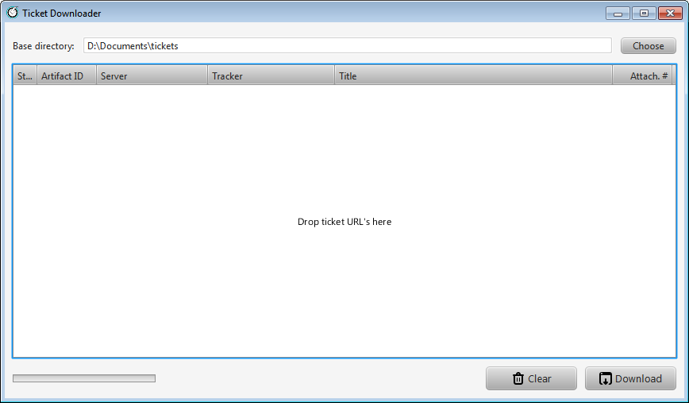

Ticket Downloader Fx - TiDoFx
=============================

TiDoFx is a small JavaFX application that can automatically download every
attachment of a TeamForge ticket into a user-definable directory.

Why?
----

When a developer starts working on a new TeamForge ticket, he or she needs
to collect all the information contained in the artifact.

Besides typical fields like Description, Reproducibility, etc., tickets
often contains extra files needed to better understand the problem.
These files are called _Attachments_ and are linked from the main ticket
page.

TiDoFx was designed to speed-up the initial collection of all this
information in a specific place in an ordered manner.

Installation
------------

TiDoFx requires an updated Java 7 JRE to run.

Because of this requirement TiDoFx is distributed in two different packages
that can be both extracted anywhere on your Hard Disk:

* A self contained archive: _TiDoFx-0.0.x-jre.zip_
  This archive contains an embedded Java Runtime Environment. By providing
  a private version of Java, a JRE does not need to be installed.
  Use this version if you don't have Java or if you have an old version. 
* A simpler application archive: _TiDoFx-0.0.x.zip_
  This archive contains only the application files and needs a properly
  installed JRE on the computer.

In both cases installation is very simple: just extract the archives
somewhere on your HD and double-click on the _Ticket Downloader.exe_ file.

Configuration
-------------

The first time the application is run, it will create its own configuration
directory in a system-specific location.

The program configuration data is stored in the following directories:

* `%APPDATA%\TiDoFx` on Windows (e.g. `C:\Users\JohnDoe\AppData\Roaming\TiDoFx`).
* `~/.tidofx` on Linux.

This directory will contain the default configuration files but, until a
proper _Preferences Window_ is implemented, you __must__ manually create one
configuration file that describes the TeamForge servers that TiDoFx will
use. This task is explained in the following __Server configuration__ section.

Another configuration option that can be modified by the user is the
name of the directory where all the attachments of a ticket will be
downloaded. This name is generated by a JavaScript function defined in the
`dir-namer.js` file located in the configuration directory.

More details on how you can customize the directory name can be found in
the JavaScript file itself or in the following __Ticket directory name customisation__
section.

#### Server configuration ####

Credentials for the TeamForge servers known to the user must be manually
entered in a configuration file named `servers.xml` located in the
configuration directory.

Here is an example of this file:

    <?xml version="1.0" encoding="UTF-8"?>
    <servers>
        <server>
            <!-- **************************************************
             |  Simple string identifying the server.
             |
             |  IMPORTANT: this id must be either "EB" or "ESO" !!!!!
             |             (without quotes)
             ************************************************** -->
            <id>EB</id>

            <!-- Longer name for the server -->
            <name>Internal TF server</name>

            <!-- Root URL of the server -->
            <url>https://tf.example.com</url>

            <!-- Username -->
            <username>username</username>

            <!-- Password (optional) -->
            <password>password</password>
        </server>

        <!-- Add other server elements here -->
    </servers>

The password field is optional. If not provided the program will ask for
a password the first time it is needed and cache it in memory for the rest
of the session.

Once the `servers.xml` file is created in the configuration directory, the
application can be used without further configuration effort if so desired.

Ticket directory name customisation
-----------------------------------

The logic for generating ticket directory names is implemented in a JavaScript
file loaded by the application at run-time. The file is named `dir-namer.js`
and is located in the application configuration directory.

This file can be edited to customise the generated names.

This file must contain the definition of a function with the following
signature:

    function generateName( ticket )

The function must return a string that represents a valid directory name
where the ticket attachments will be saved.

This function will be called by the application for each ticket whose
attachments must be downloaded.

The `ticket` argument provided to the function by the application is
a Java object that contains many attributes of the ticket being processed.
These attributes can be used to generate a directory name according to
the user needs.

Besides the argument provided to the function at each invocation, the
environment also contains the following global variables initialised by
the application at startup:

* __S__
  the String.js object containing many utility methods to operate on strings.
* __separator__
  the platform directory separator character.

The `S` variable comes from the String.js library, a JavaScript library
that provides useful extra methods to work on strings.

The `separator` variable contains the platform directory separator
character. This character can be useful when creating directory names
that contain more than one directory level. Such names can be useful
for ordering ticket directories in the filesystem according to one of
the ticket object fields.

#### The String.js library ####

The String.js library is available at http://stringjs.com.

It is loaded in the JavaScript interpreter at startup and can be accessed
using the global `S` object.

The first step to use the library is creating a String.js object from a
native JavaScript string using the `S` variable:

    var myString = S( 'I am a JavaScript string' );

Once a String.js object is created, methods can be called on it using
a fluent interface. For example, to convert a native string to lowercase
and extract the first 4 chars, we can do:

    var result = S( 'I am a JavaScript string' ).toLowerCase().left( 4 );  // 'i am'

String.js objects imports all of the native JavaScript methods.
This is for convenience. The only difference is that the imported methods
return String.js objects instead of native JavaScript strings.

An overview of the JavaScript String object and its methods can be found here:

http://www.w3schools.com/jsref/jsref_obj_string.asp

The use of String.js is entirely optional. If the regular native JavaScript
string methods are enough for generating your directory name, it's OK to
use only them and disregard entirely the `S` object.

Don't forget to read the section "Java vs. JavaScript strings" though.

#### The Ticket object ####

The ticket object provided to the function is an instance of the
tido.model.Ticket Java class.

The useful attributes of this class are:

* __url__  
  The complete artifact URL (e.g. `https://sf43.elektrobit.com/sf/go/artf74149`).
* __id__  
  The artifact id (e.g. `artf74149`).
* __title__  
  The artifact title (e.g. `[Screen] The buttons are not visible`).
* __kpm__  
  The KPM number (e.g. `50478039`).
* __tracker__  
  The Tracker that contains the ticket (e.g. `Internal Interface Tickets`).

As an example, the following function returns a directory name comprised
only of the artifact id:

    function generateName( ticket ) {
        return ticket.id;
    }

#### Java vs. JavaScript strings ####

All String attributes of the Ticket object are of type java.lang.String
and not native JavaScript strings.

While the JavaScript interpreter makes using these objects very easy
also from within a the JavaScript code, one must remember that the
methods available on one of these objects are those of the
java.lang.String class and not those of native JavaScript strings.

For example this call uses the Java method `replaceFirst()` that is not
available on a native JavaScript string

    ticket.id.replaceFirst( 'artf', '' );     // 'artf76749 ' -> '76749'

To use the String.js library, these Java String objects must be converted
to native JavaScript strings to avoid exceptions at runtime.

This conversion can be done with statements like this:

    var title = "" + ticket.title;    // title is now a JavaScript string

The concatenation of an empty native JavaScript string with a Java String
object, provided by the JVM, forces the creation of another native
JavaScript string that can afterwards be used in String.js methods.

Build
-----

Tools needed:

* A recent Java 1.7 JDK (min. 1.7.0_25)
* Gradle (not strictly necessary)

The project uses [Gradle] as build system but, to simplify development,
the Gradle Wrapper is supported. If you don't want to install Gradle, just use
the provided `gradlew` command like you would use the regular `gradle` command.

### Packaging ###

A distributable archive can be created wit the following command:

    gradlew clean distribZip

When the command terminates, a zip file can be found in the `build/distributions`
directory. 

This archive contains the application and a bundled private JRE packaged together.
The archive is big but it can be deployed on any machine regardless of local
JRE availability.

### Eclipse support ###

I am sorry but I don't use Eclipse to develop TiDoFx. Patches and comments
are welcome.

[Gradle]: http://www.gradle.org/

Credits
-------

This program uses:

* __Jsoup__: Java HTML Parser ([jsoup.org](http://jsoup.org/)).
* __String.js__: lightweight JavaScript library that provides extra String
  methods ([stringjs.com](http://stringjs.com/)).
* __Batch icons__: [adamwhitcroft.com/batch](http://adamwhitcroft.com/batch/)

License
-------

TiDoFx is licensed under the Apache License, Version 2.0 (the "License");
you may not use this file except in compliance with the License. You may
obtain a copy of the License at

http://www.apache.org/licenses/LICENSE-2.0

Unless required by applicable law or agreed to in writing, software
distributed under the License is distributed on an "AS IS" BASIS,
WITHOUT WARRANTIES OR CONDITIONS OF ANY KIND, either express or implied.
See the License for the specific language governing permissions and
limitations under the License.
